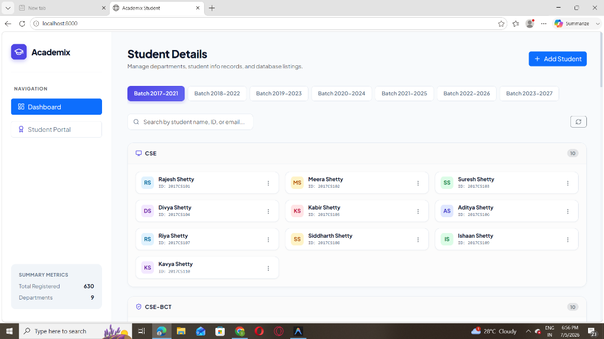
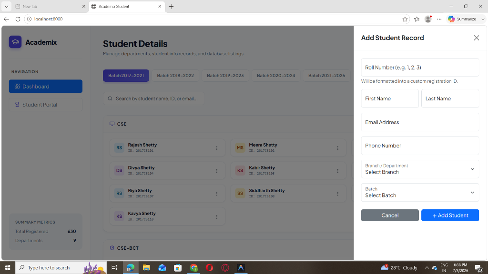
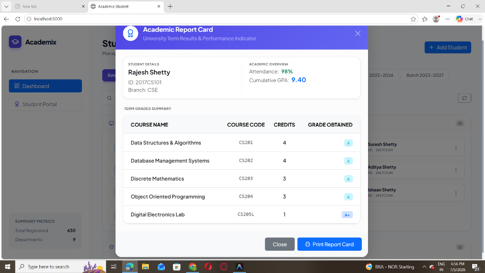

# Student Management System

A responsive web application for managing academic branches, batches, and student results. This project consists of a Java Spring Boot REST API backend linked with a MySQL database, and a vanilla CSS/Bootstrap frontend dashboard.

## Screenshots

### Student Dashboard


### Add Student Record Panel


### Student Academic Report Card


---

## Key Features

* **Department Dashboard:** View student profiles grouped by 9 branches (CSE, CSE-BCT, IT, AIDS, AIML, ECE, CIVIL, MECHANICAL, ELECTRICAL) with department-specific boards stacked vertically.
* **Batch Filtering:** Instantly filter directories using dynamic batch tab navigation (batches from 2017 to 2027).
* **Automated Roll No & ID Compiler:** Automatic compilation of unique registration identifiers  during profile additions.
* **Student Results Portal:** Secure pop-up modal to retrieve academic grade sheets, cumulative GPAs, and attendance logs directly from MySQL database records.


---

## Tech Stack

### Frontend


### Backend


### Database & DevOps


---

## Project Structure

```text
├── Backend/
│   └── student-management/
│       ├── src/
│       │   ├── main/java/com/example/student_management/
│       │   │   ├── bootstrap/      # DataSeeder
│       │   │   ├── controller/     # REST Endpoints
│       │   │   ├── entity/         # JPA entities (Student, Result)
│       │   │   ├── repository/     # Spring Data JPA repositories
│       │   │   └── service/        # Validation check layers
│       │   └── main/resources/     # application.properties
│       └── pom.xml
└── Frontend/
    ├── index.html                  # Main UI Layout & Modal overlays
    ├── style.css                   # Layout boards & visual styles
    └── script.js                   # Client side request bindings
```

---

## Getting Started

### 1. Database Setup
1. Create a MySQL database named `studentmanagement`.
2. Update the credentials in `Backend/student-management/src/main/resources/application.properties`:
   ```properties
   spring.datasource.url=jdbc:mysql://localhost:3306/studentmanagement
   spring.datasource.username=YOUR_MYSQL_USERNAME
   spring.datasource.password=YOUR_MYSQL_PASSWORD
   ```

### 2. Run the Backend Server
Navigate to the backend project root and start the application using the Maven wrapper:
```bash
cd Backend/student-management
# On Windows:
.\mvnw.cmd spring-boot:run
# On Linux/macOS:
./mvnw spring-boot:run
```
The server will start at [http://localhost:8080](http://localhost:8080). During the initial launch, the seeder will drop existing tables, create the schema, and insert 630 mock records.

### 3. Open the Frontend
Since the frontend consists of static assets, you can run it directly:
* Double-click `Frontend/index.html` to open it in your browser, or
* Run a local server (e.g. Live Server in VS Code, or `python -m http.server 8000`).

## Local Service Links

* **Backend Local Server:** [http://localhost:8080](http://localhost:8080)
* **REST API Endpoint:** [http://localhost:8080/api/students](http://localhost:8080/api/students)
* **MySQL Database URL:** `jdbc:mysql://localhost:3306/studentmanagement`

---

## API Endpoints

| Method | Endpoint | Description |
| :--- | :--- | :--- |
| **GET** | `/api/students` | Get all students (includes nested results) |
| **GET** | `/api/students/{id}` | Get student by database integer ID |
| **POST** | `/api/students` | Create a new student profile |
| **PUT** | `/api/students/{id}` | Update an existing student profile |
| **DELETE** | `/api/students/{id}` | Delete a student record |
